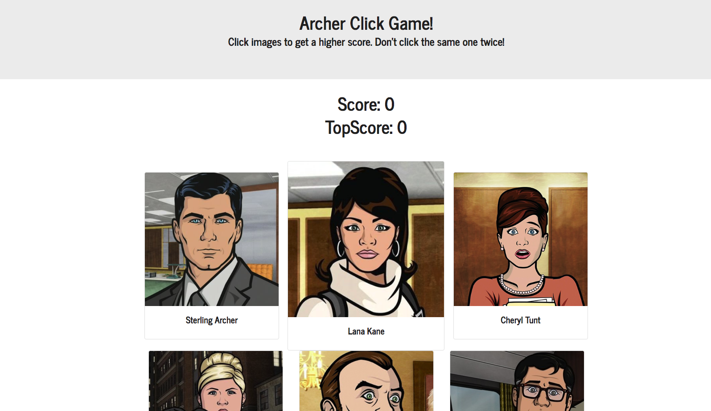

# React Mini-Game

## What is the App?

This is a basic react app meant to demonstrate the basic functionality of react and react components. The game is meant use similar functional components that can be clicked on to change their state. If the same one is clocked twice the score counter is reset. Check the app out here! https://tmullen1991.github.io/React-Game/

## How it Works

The app has a basic react file structure with most of the code put into components. The functional component in the "game" folder contains the body of the page, it binds state to a constructor has 4 functions to shuffle the character display cards on click and manage the score, and holds renders each character card with a map function. The character card information is loaded from the characters.jon file in the src directory. Npm shuffle-array is used to shuffle the json information for display. React Bootstrap is used for styling

### Purpose

The purpose of the app is explore the basic front-end functionality of react and demonstrate how it can be much easier to manage a single page application with components rather than having a multi-page application with a less simple and less organized file structure.

